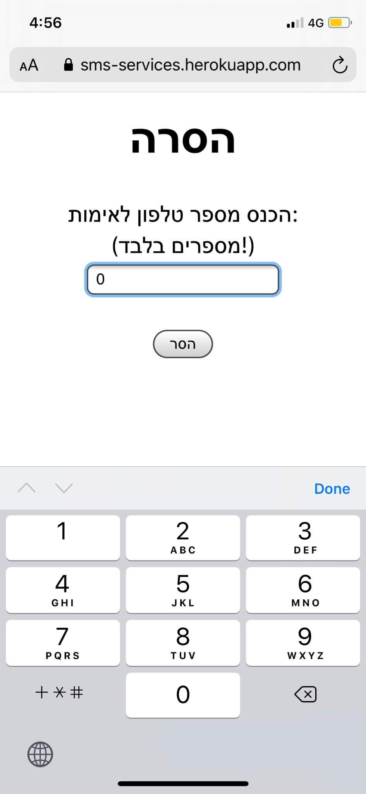

REM ## [Mor Bargig SMS Services](https://sms-services.herokuapp.com/)

REM [](https://sms-services.herokuapp.com/)


REM web site for my needs, so I can send to customers SMS with details and links to parties for my work in the night life.

REM want to use this website ? open cmd and run `git clone https://github.com/morbargig/SMS-Services.git ` to install the product 

REM after you need to install all the libraries, run `npm install`

REM run `npm start` to run the app

REM run `node server.js` to run the server

REM you need to fill this fields with your Nexmo account details 
REM ```javascript
REM const Nexmo = require('nexmo');
REM const nexmo = new Nexmo({
REM     apiKey: '??',
REM     apiSecret: '???',
REM });
REM ```

REM and don't forget to send the remove link 🔗 if you need to :)

REM ## Goals :    
REM - 09/03/2020
REM     - [X] Facebook Login
REM     - [X] firebase database 
REM     - [X] remove links 🔗 
REM     - [ ] sms services 
REM     - [ ] Design 
REM     - [ ] Credit card payment

REM ### Remove Page

REM 

    
    
    


